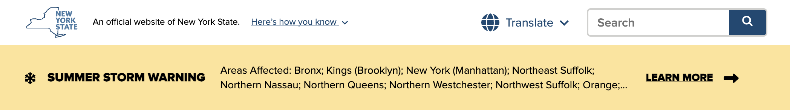
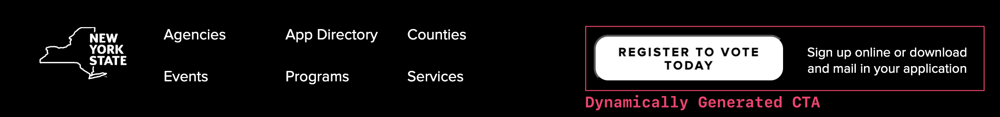

# UNav Alerts and Calls-to-Action (CTAs)

The updated UNav includes spaces for statewide alerts and calls-to-action (CTAs) that can be dynamically included in the header and footer, respectively. This is designed so that important and timely messaging can be delivered across all New York State sites consistently and effectively.

## Alerts in the Header

The header of the UNav includes a space for urgent or time-sensitive information (e.g. weather alerts, emergency notifications, etc.) These alerts are centrally managed and are displayed across all state websites that use the UNav. Alerts can be tailed by text and severity level, and can include links to more information or resources — but follow standard design and accessibility guidelines.

Alerts are hidden by default, but displayed when active.

**Header Alert Example:**

## Calls-to-Action in the Footer

The footer of the UNav includes a space for statewide calls-to-action (CTAs) that are relevant to all New York State residents (e.g. voter registration, public health campaigns, etc.) Like alerts, these CTAs are centrally managed and are displayed across all state sites that use the UNav.

