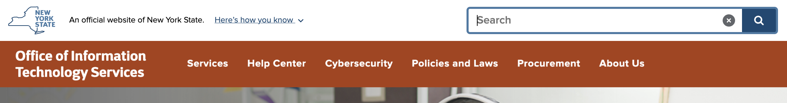

# UNav Search 

The search that is built into the updated UNav is designed to provide a consistent search experience across all New York State websites. 



## How It Works

The results are powered by a central Google Custom Search Engine (CSE). The UNav's search field is configured to show results of the domain a user searched from. In other words, if a user searches for something while visiting a page on the `its.ny.gov` domain, the search results displayed would come from `its.ny.gov`. 

Users can also expand that search to include results from all NY state sites:


## Disabling Search

Some websites or applications require their own custom search functionality. In these cases, the search option in the UNav can be disabled.

To disable search on the UNav, set the the `hideSearch` option to `true` in the header embed code. [More details in the implementation guide.](/notes/implementation.md)

```javascript
var _NY = {
  HOST: "...",
  BASE_HOST: "...",
  hideSearch: true, // False will show search option, true will hide search option
  showLanguageHeader: false,
  showLanguageFooter: false,
};
```
