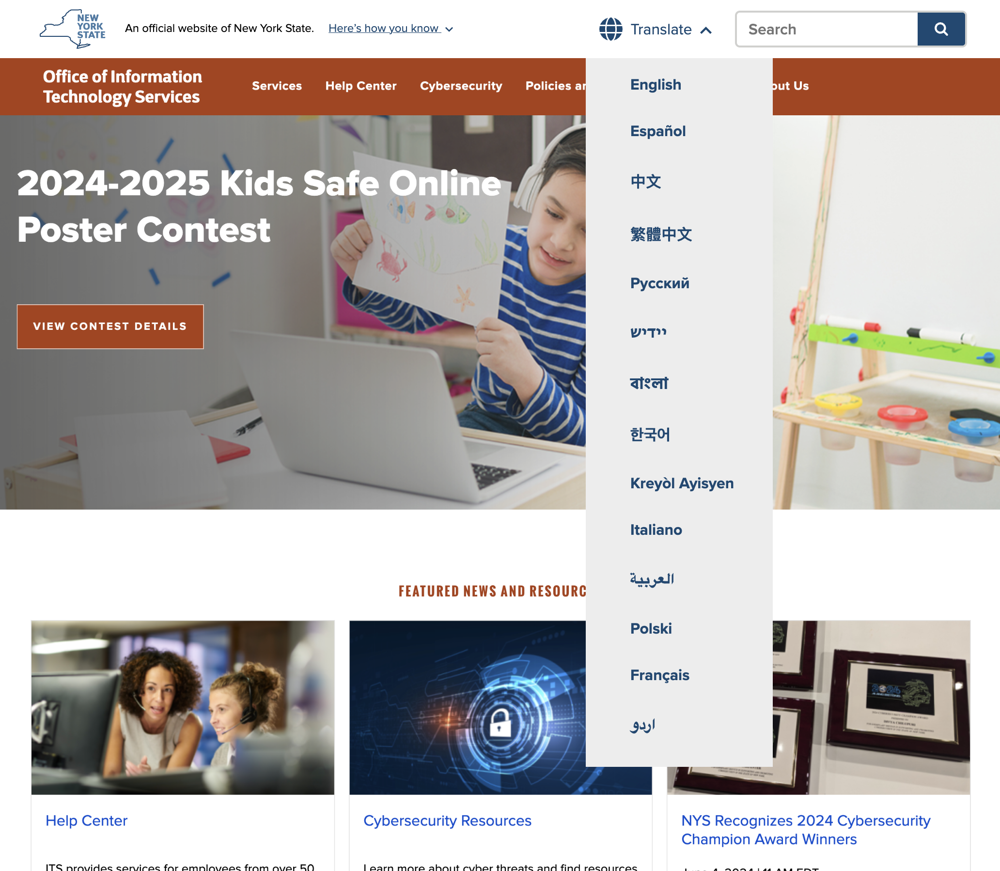

# UNav Language Selector

The language selector in the updated UNav is designed to enhance the user experience for multilingual visitors by providing easy access to a range of languages in compliance with [New York State's Language Access Law](https://ogs.ny.gov/new-york-state-language-access-law).  

Languages currently available in the language selector include: English, Español, 中文, 繁體中文, Русский, ייִדיש, বাংলা, 한국어, Kreyòl Ayisyen, Italiano, العربية, Polski, Français, and اردو.

## How It Works

The language selector is designed to work with the state's Smartling Global Delivery Network (GDN), our current language partner. When a user selects a language, they are redirected to the corresponding language subdomain (e.g. selecting "Spanish" on `ny.gov` would redirect to `es.ny.gov`).

> [!WARN]  
> Not all state websites are set up to work with Smartling. The UNav language selector will only work on sites that have been configured to use Smartling for translation services. If your site is not set up with Smartling, we recommend hiding the language selector.

## Display Options

The language selector can be displayed in the header, the footer, or both, depending on your site’s layout. However, our testing has shown that users find and use the language selector more easily when it’s placed in the header, so we strongly recommend including the language selector in the header.

To configure the placement of the language selector, use the `showLanguageHeader` and `showLanguageFooter` options in the embed code. [More details in the implementation guide.](/notes/implementation.md)

``` javascript
var _NY = {
  HOST: "...",
  BASE_HOST: "...",
  hideSearch: false,
  showLanguageHeader: true,  // Show the language selector in the header
  showLanguageFooter: false, // Hide the language selector in the footer
};
```

**Language Selector in the Header**



**Language Selector in the Footer**


## Hiding the Language Selector

If your site does not require a language selector, you can hide it by setting both `showLanguageHeader` and `showLanguageFooter` to `false` in the embed code. [More details in the implementation guide.](/notes/implementation.md)

``` javascript
var _NY = {
  HOST: "...",
  BASE_HOST: "...",
  hideSearch: false,
  showLanguageHeader: false, // Hide the language selector in the header
  showLanguageFooter: false, // Hide the language selector in the footer
};
```